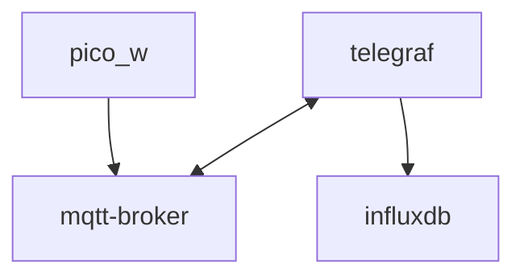
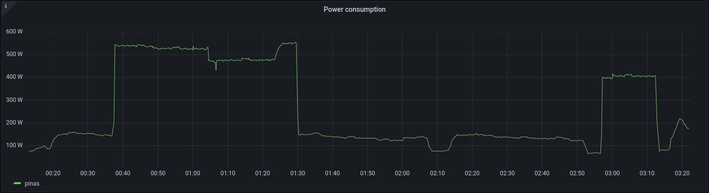

# Pico Power meter

A MicroPython project to read a home power meter's impulse LED, convert the rate to watts, and publish this data to an MQTT server. The program is written for the RPi Pico W.

## Requirements
This program is written in MicroPython for the Pico W. Instructions for installing MicroPython can be found on the  [official raspberry pi website](https://projects.raspberrypi.org/en/projects/get-started-pico-w/1)

Additional requirements used are `mqtt-simple` and `mqtt-robust`, these need to be installed on the board using mip. Connect to the board and install:

```shell
import mip
mip.install('umqtt.simple')
mip.install('umqtt.robust')
```

Note that you need to connect the board to Wi-Fi for this to work. Refer to the official documentation for instructions.

# Getting the data
The microcontroller will publish to an MQTT broker via the onboard Wi-Fi chip. The data published is in JSON format and is intended to be used by InfluxDB, but could be adapted for other use cases. To configure publishing, you need to add a file called `secrets.py` in `lib/`:

```python

WIFI_SSID = "SSID-To Connect to"
WIFI_PASS = "wifi passwword"

# Note, there is no address resolution configured, this should be an IP

MQTT_SERVER = "SERVER ADDRESS" 
MQTT_PORT = 1883
HOSTNAME = "Name of this board"
SERIESNAME = "Name of influxdb series"
MQTT_TOPIC = "MQTT topic to publish to"
```

There is no security configured by default for the MQTT broker, so the broker should be configured to accept anonymous requests. Do not expose this to the Internet without implementing security measures.

The board will then publish mqtt messages to `MQTT_TOPIC` formatted as JSON, like so:

```json
{
    'power': '<MEASURED POWER>',
    'timestamp': '<UNIX TIMESTAMP>',
    'measurement': <SERIESNAME>,
    'host': <HOSTNAME>
}
```

## Example configuration
There is no need to follow this, it is just an example of how I set it up. I use telegraf to subscribe to the mqtt-broker and then publish this data to an influx database.

The flow is something like this:



I use [mosquitto](https://mosquitto.org/) for the mqtt broker with an anonumous config like so: 

mosquitto.conf
```conf
allow_anonymous true
listener <MQTT_PORT> 0.0.0.0
```

This allows anyone to publish and the messages are not encrypted so do not expose to the internet without configuring ssl and authentication.

Then I configure telegraf to subscribe to mosquitto:

telegraf.conf

```conf
[[inputs.mqtt_consumer]]
  servers = ["tcp://<MQTT_SERVER>:<MQTT_PORT>"]
  topics = [ "topic1", "topic2" ] # Configure any topics you use here
  topic_tag = ""
  data_format = "json"
  json_name_key = "measurement"
  json_time_key = "timestamp"
  json_time_format = "unix"
  tag_keys = [
    "host"
  ]
```

Telegraf must also be configured to publish to your influxdb instance, more about this in the [official docs](https://github.com/influxdata/telegraf/blob/master/plugins/outputs/influxdb/README.md)

The `json_name_keys` must match the json output format from the the pico. Essentially this will make telegraf publish the incoming messages into influx line format like so:

Json from pico
```json
{
    'power': '<MEASURED POWER>',
    'timestamp': '<UNIX TIMESTAMP>',
    'measurement': <SERIESNAME>,
    'host': <HOSTNAME>
}
```
write to influx:

```text
<SERIESNAME>,host=<HOSTNAME> power=<MEASURED POWER> <UNIX TIMESTAMP>
```

And the data will be stored in influxdb as follows:

Database: `telegraf`<br>
Measurement: `<SERIESNAME>`

Database entry:
```text
time                host       power
----                ----       -----
<UNIX TIMESTAMP_MS> <HOSTNAME> <MEASURED POWER>
```

You can then query this data in for example Grafana with a query like this:

```sql
SELECT last("power") FROM "<SERIESNAME>" WHERE $timeFilter GROUP BY time($interval), "host" ORDER BY time DESC
```

And you can get a nice graph like this:


